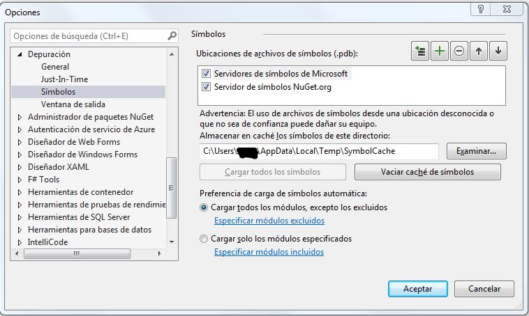
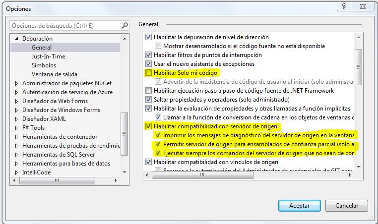

# Meetup github setup

[Video](https://www.youtube.com/watch?v=hilY0lLxaOs) en youtube

## 1. Creación del proyecto

Primero, creamos un repo en github y lo clonamos, o iniciamos un repositorio en local y le ponemos como remote el repositorio de github creado.

Una vez tenemos git funcionando, montamos una solución en visual studio, con al menos dos proyectos:

1. La librería de clases 

2. Un proyecto con tests unitarios, que tendrá una referencia a la librería de clases


## 2. Definir ficheros de configuración

Podemos definir un fichero *global.json*, que guardará la versión necesaria del SDK de netcore para que la solución funcione. Así, a quien se clone el repositorio y no tenga el SDK necesario, le avisará de que necesita esa versión concreta.

````
dotnet new global.json
````

También podemos definir otro fichero, *dotnet-tools.json*. Con el siguiente comando: 
````
dotnet new tool-manifest
````
Este fichero guarda la relación de herramientas que hemos instalado en la solución. Si alguien se descarga el repositorio, solo tiene que hacer *dotnet tool restore* para que se restauren y tener disponibles las herramientas especificadas.

Ahora, procedemos a crear 3 ficheros:

##### build/dependencies.props

Creamos una carpeta en la raiz del repositorio llamada *build*, y en su interior un fichero llamado *dependencies.props*. Este fichero contendrá algunas variables, que despues referenciaremos en los ficheros csproj
````
<Project>
    <PropertyGroup Label="Default SDK Versions">
        <NetCoreAppVersion>netcoreapp3.1</NetCoreAppVersion>
        <NetStandardVersion>netstandard2.0</NetStandardVersion>
    </PropertyGroup>
</Project>
````

En el ejemplo, me he definido dos variables, una con la versión de netcore que voy a usar, y otra con la versión de netstandard. De esta manera, cuando tenga multiples proyectos en mi solución, en vez de que cada uno referencie el SDK concreto, hara referencia a la variable definida. En el momento que quiera subir o bajar alguna versión, lo actualizaré en el fichero que acabo de crear.

El fichero csproj de la librería de clases haciendo referencia a la variable quedaría así:
````
<Project Sdk="Microsoft.NET.Sdk">
  <PropertyGroup>
    <TargetFramework>$(NetStandardVersion)</TargetFramework>
  </PropertyGroup>
</Project>
````

##### Directory.Build.props

En la raiz del repositorio, creamos un fichero llamado Directory.Build.props
````
<Project>
    <Import Project="build/dependencies.props"/>
    <PropertyGroup Label="Default Metadata">
        <Authors>Authors name</Authors>
        <Company>Company name</Company>
        <RepositoryUrl>repo url</RepositoryUrl>
    </PropertyGroup>
</Project>
````
Este fichero referencia al que hemos creado anteriormente, *build/dependencies.props*, y establece una serie de propiedades que serán comunes a todos los proyectos. En este caso hemos definido el autor, la empresa que realiza la aplicación y la url del repositorio donde se aloja el código. De esta manera, tendremos estas propiedades centralizadas en un solo fichero, en lugar de estar desperdigadas por los múltiples ficheros csproj que contenga la solución.


##### Directory.Build.targets

En la raiz del repositorio, creamos un fichero llamado Directory.Build.targets
````
<Project> 
    <ItemGroup Label="Test">
        <PackageReference Update="Microsoft.NET.Test.Sdk" Version="16.5.0" />
        <PackageReference Update="xunit" Version="2.4.0" />
        <PackageReference Update="xunit.runner.visualstudio" Version="2.4.0" />
        <PackageReference Update="coverlet.collector" Version="1.2.0" />
    </ItemGroup>
</Project>
````
En este fichero definiremos todas las referencias a paquetes nuget que tengamos en cualquiera de los proyectos de la solución. Esto nos permitirá eliminar la referencia a la versión en cada uno de los csproj. Por ejemplo, mi csproj del proyecto de tests unitarios quedaría así:

````
<Project Sdk="Microsoft.NET.Sdk">

  ... omited code for brevity ...
  
  <ItemGroup>
    <PackageReference Include="Microsoft.NET.Test.Sdk" />
    <PackageReference Include="xunit" />
    <PackageReference Include="xunit.runner.visualstudio" />
    <PackageReference Include="coverlet.collector" />
  </ItemGroup>
  
  ...
  
</Project>
````

Esto nos permite definir en un único fichero todos los paquetes nuget que estamos consumiendo, con su versión completa. Cuando vaya añadiendo proyectos a mi solución, y estos proyectos tengan que consumir los mismos paquetes nuget que ya consumen otro proyectos, referenciarán todos las misma versión que tiene el fichero Directory.Build.targets.

Centralizando las versiones en un mismo fichero, evitamos que distintos proyectos en la solución consuman el mismo paquete nuget, pero diferentes versiones. Esto provocaría warnings de compilación o errores, y resolverlos suele ser una tarea ardua y engorrosa.


## 3. Source Link

Source link es una tecnología que permite depurar código de las dependencias nuget que utilicemos. Para que funcione, el paquete nugget en cuestión tiene que tenerlo habilitado, y hay que configurar visual studio en la máquina desde la que estemos consumiendo el paquete nuget.

##### Configurar visual studio para poder consumir paquetes nuget con Source Link

Activar la descarga de símbolos en: Herramientas / Opciones / Depuración / Símbolos



Activar y desactivar las siguientes opciones en Herramientas / Opciones / Depuración / General



Cuando quiera dejar de entrar en paquetes nuget al depurar, puedo activar el check de habilitar solo mi código.

##### Configurar mi solución para que funcione Source Link

Añadir lo siguiente en el fichero Directory.Build.props

````
<Project>
    <Import Project="build/dependencies.props"/>
    <PropertyGroup Label="Default Metadata">
        ...
        <PackageProjectUrl>url del repo</PackageProjectUrl>
        <RepositoryUrl>url del repo</RepositoryUrl>
        <PublishRepositoryUrl>true</PublishRepositoryUrl>
        <IncludeSymbols>true</IncludeSymbols>
        <SymbolPackageFormat>snupkg</SymbolPackageFormat>
        <EmbedUntrackedSources>true</EmbedUntrackedSources>
        <AllowedOutputExtensionsInPackageBuildOutputFolder>true;</AllowedOutputExtensionsInPackageBuildOutputFolder>
        ...
    </PropertyGroup>
    
    <PropertyGroup>
        <ContinuousIntegrationBuild>true</ContinuousIntegrationBuild>
    </PropertyGroup>
</Project>
````
En las propiedades, indicamos la url del repositorio, incluimos los símbolos, en formato de nuget (snupkg). También ponemos ContinuousIntegrationBuild para tener builds determinísticas, y que en cada build se haga un despliegue. Que las builds sean determinísticas quiere decir que a partir del mismo código fuente, siempre obtenemos el mismo resultado binario.

De cualquier manera, como la build determinística solo nos interesa en el entorno de despliegue continuo, y no en local, podemos añadirle una condición:
````
<PropertyGroup Condition="'$(GITHUB_ACTIONS)' == 'true'">
    <ContinuousIntegrationBuild>true</ContinuousIntegrationBuild>
</PropertyGroup>
````

Además, es necesario incluir una referencia al paquete de nuget relativo a Source Link del sitio donde alojes el código, en nuestro caso github.

````
<ItemGroup>
    <SourceRoot Include="$(MSBuildThisFileDirectory)/"/>
    <PackageReference Include="Microsoft.SourceLink.GitHub" Version="1.0.0">
        <PrivateAssets>all</PrivateAssets>
        <IncludeAssets>runtime; build; native; contentfiles; analyzers</IncludeAssets>
    </PackageReference>
</ItemGroup>
````

Por último, hay que hacer un pequeño workaround para que las propiedades comunes se copien en el paquete de source link que se genera. Hay que incluir en el Directory.Build.targets:

````
<ItemGroup>
    <!-- https://github.com/dotnet/sourcelink/issues/572 -->
    <EmbeddedFiles Include="$(GeneratedAssemblyInfoFile)"/>
</ItemGroup>
````

Solo faltaría añadir las propiedades particulares a nuestro proyecto principal, como la versión y la descripción. Incluiríamos en el csproj:
````
<PackageVersion>1.0.1$(VersionSuffix)</PackageVersion>
<Description>description</Description>
````

## 4. Scripts de utilidad

Destacar varios scripts que son de utilidad. Todos los scripts están disponibles en formato powershell para windows y bash para linux o mac

- dotnet-install -> Script que instala el sdk de netcore

- install-sdk -> Llama al script anterior, para instalar la versión concreta que requiere el proyecto. (Que debería coincidir con la que definimos en el fichero *global.json*)

- build -> Compila el proyecto, pasa los tests, y genera el paquete nuget en la carpeta artifacts


## 5. Implementar la integración continua en Github actions para publicar un paquete Nuget

Podemos crear una Action en github que desencadene el proceso de despliegue, que implicaría lo siguiente:

- Compilar nuestro código

- Pasar los tests

- Generar el paquete nuget

- Desplegarlo a nuget.org


#### 1. Crear un fichero ci.yaml en .github/workflows

#### 2. Completarlo con algo del estilo a esto:

````
name: Publish on Nuget

on:
    pull_request:
        branches: 
          - master
    push:
        branches: 
          - master

jobs:

  build:

    runs-on: ubuntu-latest

    name: Build, pack & publish
    
    steps:

      - uses: actions/checkout@v2

      - uses: actions/setup-dotnet@v1
        with:
          dotnet-version: '3.1.x'
      - name: Build & Test
        run: |
          dotnet build
          dotnet test

      - name: publish on version change
        id: publish_nuget
        uses: rohith/publish-nuget@v2
        with:
          # Filepath of the project to be packaged, relative to root of repository
          PROJECT_FILE_PATH: src/AwesomeLibrary/AwesomeLibrary.csproj
          
          # NuGet package id, used for version detection & defaults to project name
          PACKAGE_NAME: PackageId property from csproj 

          # Regex pattern to extract version info in a capturing group
          VERSION_REGEX: <PackageVersion>(.*)<\/PackageVersion>

          # API key to authenticate with NuGet server
          NUGET_KEY: ${{secrets.NUGET_API_KEY}}
````

En cada push / pull request a master:

- Configura un entorno linux con netcore
- Compila la aplicación
- Lanza **todos los test** que haya en el repositorio
- Publica el paquete nuget generado

#### 3. A tener en cuenta:

- Definir el nombre del paquete (variable PACKAGE_NAME en la action y PackageId en csproj) correctamente. Si el nombre no es único, y ya existe otro paquete con ese nombre de otra organización, la build puede fallar con un 403.

- Crear una variable en *Settings / Secrets* del repositorio en Github, cuyo nombre será NUGET_API_KEY y su valor la api key de tu cuenta en nuget.org

- Definir en el csproj lo siguiente:
````
  <PropertyGroup>
    <PackageVersion>1.1</PackageVersion>
    <PackageId>Company.ProjectName</PackageId>
  </PropertyGroup>
````

- Tal y como hemos configurado *rohith/publish-nuget@v2*, toma la versión de las propiedades del csproj (de la propiedad PackageVersion). Si la versión ya existiera, nos dará un error 409